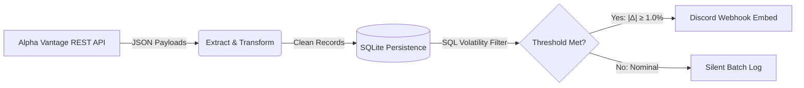

# Real-Time Equity Surveillance & ETL Pipeline


An automated data pipeline that extracts real-time equity market data, normalizes relational structures into SQLite, evaluates price volatility metrics against configured thresholds, and delivers rich embed alerts via Discord webhooks.

## Architecture Overview

1. **Extract:** Pulls real-time quote feeds (`GLOBAL_QUOTE`) from Alpha Vantage REST APIs with built-in rate-limiting compliance.
2. **Transform & Load:** Flattens multi-field nested JSON payloads into uniform schemas and appends records to local relational storage (`SQLite`).
3. **Analyze & Alert:** Executes vectorized SQL evaluations over the latest ingestion batch to flag volatility spikes ($|\Delta| \ge \text{threshold}$) and dispatches structured webhook alerts.
4. **CI/CD Automation:** Scheduled via GitHub Actions cron triggers across active market trading sessions (pre-market, intraday, and power hour).



## Tech Stack

* **Language:** Python 3.11+
* **Data Processing:** Pandas, SQLite
* **Networking & Transport:** Requests, Discord Webhooks API
* **Workflow Automation:** GitHub Actions (CI/CD)

## Local Setup

1. Clone the repository:
   ```bash
   git clone [https://github.com/naveen-randhawa/market-alert-pipeline.git](https://github.com/naveen-randhawa/market-alert-pipeline.git)
   cd market-alert-pipeline