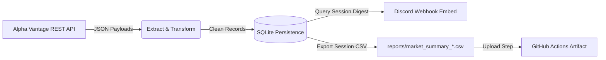

# Real-Time Equity Surveillance & ETL Pipeline

An automated equity surveillance and daily reporting pipeline built in Python. The system extracts market data for a target equity basket, persists normalized records to an append-only SQLite store, dispatches structured summaries to Discord via webhooks, and archives daily session data as downloadable CI/CD workflow artifacts.

## Architecture Overview

1. **Extract:** Pulls equity quote feeds (`GLOBAL_QUOTE`) from Alpha Vantage REST APIs with built-in rate-limiting compliance.
2. **Transform & Load:** Flattens multi-field nested JSON payloads into uniform schemas and appends records to local relational storage (`SQLite`).
3. **Analyze & Digest:** Compiles closing metrics across monitored tickers and dispatches formatted, multi-column Discord webhook embeds.
4. **CI/CD Automation & Retention:** Executes hands-off via GitHub Actions scheduled post-market close, exporting daily session datasets to `reports/` and uploading them as retained workflow artifacts.

## Tech Stack

* **Language:** Python 3.11+
* **Data Processing:** Pandas, SQLite
* **Networking & Transport:** Requests, Discord Webhooks API
* **Workflow Automation:** GitHub Actions (CI/CD)